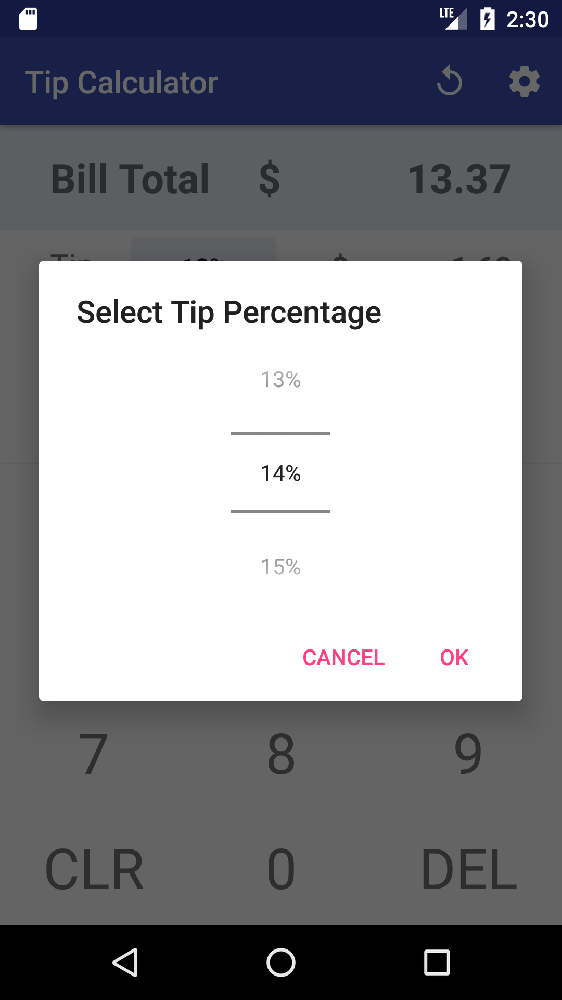
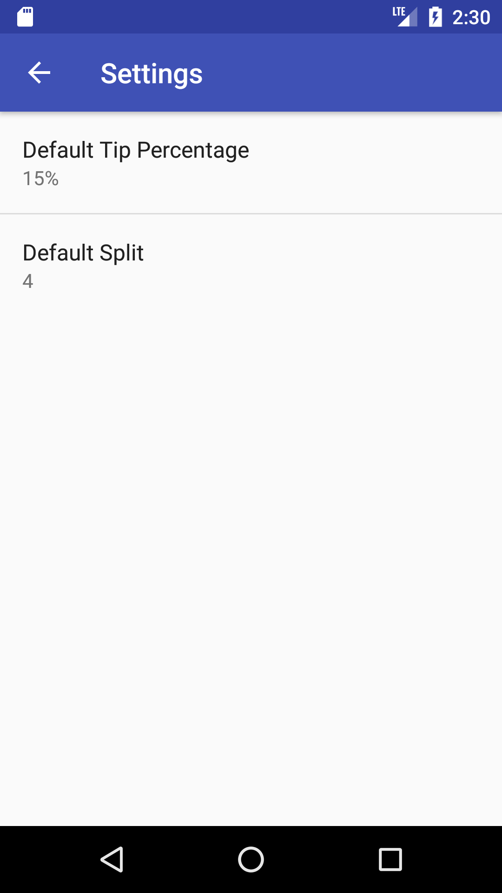

# Tip Calculator
My first Android application. Might come in handy some day I suppose?

Thanks to [this video](https://www.youtube.com/watch?v=kkYIMZw9gzQ) and some other tip calculators on Play Store for reference.

Yeah, there is already a lot of tip caculators, but I just want to implement a tip calculator in my own way and most of all, gain valuable experience.

App icon generated by [Android Asset Studio](https://romannurik.github.io/AndroidAssetStudio/)

# Features
What do you expect?
- [x] Tip calculation -- duh.
- [x] Tip percentage selection
- [x] Split bill
- [x] Immediate calculation -- no need to press the ugly "Calculate" button
- [x] Not exactly a feature but I guess it looks cooler than some other tip calculators?

# TO-DO
- [x] Settings - default tip percent and splits (is it how you call it? split/splits/split amount/number of splits?)
- [x] A reset button to reset tip percent and split to default values
- [x] App icon (cuz it's cool?)
- [ ] better design? Idk. Maybe onPressed effect on keypad? Need to do some reading on Android material design :joy:

# Screenshots
Who doesn't like screenshots?

